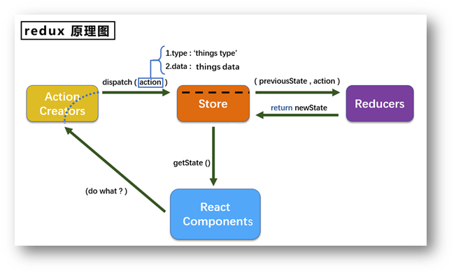

# react

 React 是一个声明式，高效且灵活的用于构建用户界面的 JavaScript 库 。

## 一.react简介

### 特点

1. 采用组件化模式，声明式编码，提高开发效率及组件复用率
2. 在React Native中可以使用React语法进行移动端开发
3. 使用虚拟DOM+优秀得Diffing算法，尽量减少与真实DOM得交互

### 基础掌握

判断this指向

class类

ES6语法规范

npm包管理器

原型，原型链

数组常用方法

模块化

### 关于虚拟DOM

1. 本质是Object类型的对象（一般对象）
2. 虚拟DOM比较“轻”，真实DOM比较“重”，因为虚拟DOM是React的内部实现，无需真实DOM上那么多的属性
3. 虚拟DOM最终会被React转换为真是DOM，呈现再页面上

### jsx 语法规则

1. 定义虚拟DOM时不要写引号
2. 标签中混合js表达式要用{}
3. 样式的类名指定不要用class，要用className
4. 内联样式：需要使用style={{key: value, key: value,}}的形式
5. 虚拟DOM只能有一个根标签
6. 标签必须闭合
7. 标签首字母：
   1. 首字母小写开头，则将该标签转为html中同名元素，若html中没有该标签，则报错
   2. 首字母大写开头，react就去渲染对应的组件，若组件没有定义，则报错

## 二.react面向组件编程

函数式组件：用函数定义的组件（适用于简单组件的定义）

类式组件：用类定义的组件（使用于复杂的组件的定义）

### 组件三大核心1——state

1. state是组件对象最重要的属性, 值是对象(可以包含多个key-value的组合)

2. 组件被称为"状态机", 通过更新组件的state来更新对应的页面显示(重新渲染组件)

**注意：**

1. 组件中render方法中的this为组件实例对象

2. 组件自定义的方法中this为undefined，如何解决？

   a)   强制绑定this: 通过函数对象的bind()

   b)   箭头函数

3. 状态数据，不能直接修改或更新

### 组件三大核心2——props

1. 每个组件对象都会有props(properties的简写)属性

2. 组件标签的所有属性都保存在props中

**作用：**

1. 通过标签属性从组件外向组件内传递变化的数据

2. 注意: 组件内部不要修改props数据

### 组件三大核心3——refs

​	组件内的标签可以定义ref属性来标识自己

**事件：**

1. 通过onXxx属性指定事件处理函数(注意大小写)

   1)   React使用的是自定义(合成)事件, 而不是使用的原生DOM事件----为了更好的兼容性

   2)   React中的事件是通过事件委托方式处理的(委托给组件最外层的元素)----为了高效

2. 通过event.target得到发生事件的DOM元素对象 ----不要过度使用ref

#### ref分类：

1. 字符串ref: 

  ```html
  <input ref="input1" id="input" type="text" placeholder="输入内容" />
  ```

  ```js
  showData = () => { // 类中默认开启了严格模式，普通函数写法中this值为undefined，使用箭头函数后this指向实例
    console.log('ewewe',this, this.refs.input1)
    // const input = document.getElementById('input')
    // alert(input.value)
    const {input1} = this.refs
    alert(input1.value)
  }
  ```

2. 回调函数ref:

  ```html
  <input ref={(current) => {this.input1 = current}} id="input" type="text" placeholder="输入内容" />
  ```

  ```js
  showData = () => { // 类中默认开启了严格模式，普通函数写法中this值为undefined，使用箭头函数后this指向实例
    // console.log('ewewe',this, this.refs.input1)
    // const {input1} = this.refs
    // alert(input1.value)
    const {input1} = this
    alert(input1.value)
  }
  ```

3. createRef():

  ```js
  class Test extends React.Component{
    // React.createRef()返回一个容器，该容器可以存储被ref所标识的节点,该容器“专人专用”
    myRef = React.createRef()
    myRef1 = React.createRef()
    render() {
      return (
        <div>
          <input ref={this.myRef} id="input" type="text" placeholder="输入内容" />  
          <button onClick={this.showData}>点击提示左侧输入数据</button>
          <input ref={this.myRef1} type="text" onBlur={this.alertData} placeholder="失焦提示输入数据" />
        </div>
      )
    }

    showData = () => { // 类中默认开启了严格模式，普通函数写法中this值为undefined，使用箭头函数后this指向实例
      console.log(this.myRef)
      alert(this.myRef.current.value)
    }

    alertData = () => {
      alert(this.myRef1.current.value)
    }
  }
  ReactDOM.render(<Test />, document.getElementById('test')) /*挂在虚拟DOM*/
  ```

## 三.react生命周期钩子

### 生命周期流程（旧）

.png)

**生命周期的三个阶段(旧)：**

**1. 初始化阶段**：由ReactDOM.render()触发--初次渲染

	1. constructor()
	2. componentWillMount()
	3. render()
	4. componentDidMount()

**2. 更新阶段**：由组件内部this.setState()或父组件重新render触发

 	1. shouldComponentUpdate()
 	2. componentWillUpdate()
 	3. render()
 	4. componentDidUpdate()

**3. 卸载组件**：由ReactDOM.unmountComponentAtNode()触发

 	1. componentWillUnmount()

### 生命周期流程（新）

.png)

**生命周期的三个阶段（新）：**

**1. 初始化阶段：**由React DOM.render()触发--初次渲染

1. constructor()
2. ***getDerivedStateFromProps***
3. render()
4. componentDidMount()

**2. 更新阶段：**由组件内部this.setState()或父组件重新render触发

1. ***getDeriverdStateFromPorps***
2. shouldComponentUpdate()
3. render()
4. ***getSnapshotBeforeUpdate***
5. componentDidUpdate()

**3. 写在组件：**由ReactDOM.unmountComponentAtNode()触发

1. componentWillUnmount()

**重要的钩子：**

1. render：初始化渲染或更新渲染调用
2. componentDidMount：开启监听，Ajax
3. componentWillUnmount：做收尾工作，如：清理定时器

**即将废弃的钩子：**

1. componentWillMount
2. componentWillReceiveProps
3. componentWillUpdate

注意：现在使用会出现警告，下一个版本（17.0）需加上UNSAFE_前缀才能使用，以后可能会被彻底废弃，不建议使用。


## 四.react配置开发环境代理

### 方法一

> 在package.json中追加如下配置：
>
> "proxy": "http://localhost:500"

说明：

1. 优点：配置简单，前端请求资源时可以不加任何前缀。
2. 缺点：不能配置多个代理。
3. 工作方式：上述方式配置代理，当请求了3000不存在的资源时，那么该请求会转发给5000 （优先匹配前端资源）

### 方法二

1. 第一步：创建代理配置文件

> 在src下创建配置文件：src/setupProxy.js

2. 编写setupProxy.js配置具体代理规则：

```js
const proxy = require('http-proxy-middleware')

module.exports = function(app) {
  app.use(
    proxy('/api1', {  //api1是需要转发的请求(所有带有/api1前缀的请求都会转发给5000)
      target: 'http://localhost:5000', //配置转发目标地址(能返回数据的服务器地址)
      changeOrigin: true, //控制服务器接收到的请求头中host字段的值
      /*
      	changeOrigin设置为true时，服务器收到的请求头中的host为：localhost:5000
      	changeOrigin设置为false时，服务器收到的请求头中的host为：localhost:3000
      	changeOrigin默认值为false，但我们一般将changeOrigin值设为true
      */
      pathRewrite: {'^/api1': ''} //去除请求前缀，保证交给后台服务器的是正常请求地址(必须配置)
    }),
    proxy('/api2', { 
      target: 'http://localhost:5001',
      changeOrigin: true,
      pathRewrite: {'^/api2': ''}
    })
  )
}
```

说明：

1. 优点：可以配置多个代理，可以灵活的控制请求是否走代理。
2. 缺点：配置繁琐，前端请求资源时必须加前缀。

### 注意：

对于react版本17.0.2，用第二种方法无法解决跨域问题，需下载新的http-proxy-middleware

```
yarn add http-proxy-middleawre
```

setupProxy.js写法如下：

```javascript
const {createProxyMiddleware} = require('http-proxy-middleware')
module.exports = function(app){
	app.use(
		createProxyMiddleware('/api',{ //遇见/api1前缀的请求，就会触发该代理配置
			target:'http://localhost:5000', //请求转发给谁
			changeOrigin:true,//控制服务器收到的请求头中Host的值
			pathRewrite:{'^/api':''} //重写请求路径(必须)
		}),
		createProxyMiddleware('/api1',{
			target:'http://localhost:600',
			changeOrigin:true,
			pathRewrite:{'^/api1':''}
		}),
		createProxyMiddleware('/api2',{
			target:'http://localhost:5001',
			changeOrigin:true,
			pathRewrite:{'^/api2':''}
		}),
	)
}
```

## 五.react路由

### react路由的基本使用

1. 下载依赖：`yarn add react-router-dom`

2. 路由链接：`<Link className="list-group-item" to='/about' >about</Link>`

3. 注册路由：

   ```jsx
    {/* 下面是react-router-dom 注册路由  5.x.x版本写法 */}
    {/* <Route path='/home' component={home}></Route>
    <Route path='/about' component={about}></Route> */}
   
    {/* 下面是react-router-dom 注册路由 6.x.x版本写法 */}
    <Routes>
      <Route path="/home" element={<Home />} />
      <Route path="/about" element={<About />} />
    </Routes>
   ```


4. 路由器对象：`<App />`的最外侧包裹了一个`<BrowserRouter>`或`<HashRouter>`

### 路由组件与一般组件

1. 写法不同：

   一般组件：`<Demo/>`

   路由组件：`<Route path="/demo" component={Demo}/>`

2. 存放位置不同：

    一般组件：components

    路由组件：pages

3. 接收到的props不同：

    一般组件：写组件标签时传递了什么，就能收到什么

    路由组件：接收到三个固定的属性

        history:
        
            go: ƒ go(n)
        
            goBack: ƒ goBack()
        
            goForward: ƒ goForward()
        
            push: ƒ push(path, state)
        
            replace: ƒ replace(path, state)
        
        location:
        
            pathname: "/about"
        
            search: ""
        
            state: undefined
        
        match:
        
            params: {}
        
            path: "/about"
        
            url: "/about"

### 路由组件传参（V5版本）

#### 1.params参数

> 路由链接(携带参数)：<Link to='/demo/test/tom/18'}>详情</Link>
> 注册路由(声明接收)：<Route path="/demo/test/:name/:age" component={Test}/>
> 接收参数：this.props.match.params

#### 2.search参数

> 路由链接(携带参数)：<Link to='/demo/test?name=tom&age=18'}>详情</Link>
> 注册路由(无需声明，正常注册即可)：<Route path="/demo/test" component={Test}/>
> 接收参数：this.props.location.search
> 备注：获取到的search是urlencoded编码字符串，需要借助querystring解析

#### 3.state参数

> 路由链接(携带参数)：<Link to={{pathname:'/demo/test',state:{name:'tom',age:18}}}>详情</Link>
> 注册路由(无需声明，正常注册即可)：<Route path="/demo/test" component={Test}/>
> 接收参数：this.props.location.state
> 备注：刷新也可以保留住参数

#### 注意：

在react-router-dom **V6** 版本中路由组件也可传参了

### 编程式路由导航

借助this.prosp.history对象上的API对操作路由跳转、前进、后退

> -this.prosp.history.push()
> -this.prosp.history.replace()
> -this.prosp.history.goBack()
> -this.prosp.history.goForward()
> -this.prosp.history.go()

### BrowserRouter与HashRouter的区别

1. 底层原理不一样：

   BrowserRouter使用的是H5的history API，不兼容IE9及以下版本。
   HashRouter使用的是URL的哈希值。

2. path表现形式不一样：

   BrowserRouter的路径中没有#,例如：localhost:3000/demo/test
   HashRouter的路径包含#,例如：localhost:3000/#/demo/test

3. 刷新后对路由state参数的影响：

   (1).BrowserRouter没有任何影响，因为state保存在history对象中。
   (2).HashRouter刷新后会导致路由state参数的丢失！！！

**注意：**HashRouter可以用于解决一些路径错误相关的问题

## 六.redux

### redux 三个核心



1. action：动作对象

   包含二个属性

   * type：标识属性，值为字符串，唯一，必要属性
   * data：数据属性，值类型任意，可选属性

   例如：{type: 'increment', data: {name: 'zhangsan',age:19}}

2. store：将state、action、reducer联系在一起的对象

   创建方式：

   > import {createStore} from 'redux'
   >
   > import reducer from './reducers'
   >
   > const store = createStore(reducer)

   store对象功能：

   1. getState(): 得到state
   2. dispatch(action): 分发action，触发reducer调用，产生新的state
   3. subscribe(listener): 注册监听，当产生了新的state时，自动调用

3. reducer：用于初始化状态，加工状态

   加工时，根据旧的state和action，产生新的state的**纯函数**

## 七.react-redux

1. 所有的UI组件都应该包裹一个容器组件，他们是父子关系
2. 容器组件是真正和redux打交道的，里面可以随意的使用redux的api
3. UI组件中不能使用任何redux的api
4. 容器组件会传给UI组件：（1）redux中所保存的状态。（2）用于操作状态的方法
5. 备注：容器给UI传递：状态、操作状态的方法，均通过props传递

### 基本使用

1. 明确二个概念：

   1）UI组件：不能使用任何redux的api,只负责页面的呈现、交互等

   2）容器组件：负责和redux通信，将结果交给UI组件

2. 如何创建一个容器组件——react-redux的connect函数

   connect(mapStateToProps,mapDispatchToProps)(UI组件)

   ​	-mapStateToProps:映射状态，返回值是一个对象

   ​	-mapDispatchToProps:映射操作状态的方法，返回值是一个对象

3. 备注1：容器组件中的store是靠props传进去的，而不是在容器组件中直接引入

4. 备注2：mapDispatchToProps也可以是一个对象、

### 优化

1. 容器组件和UI组件整合成一个文件

2. 无需自己给容器组件传递store，给<APP />包裹一个<Provider store = {store}>即可

3. 使用react-redux后也不用再自己检测redux中状态的改变了，容器组件可以自己完成这个工作

4. mapDispatchToProps也可以简单写出一个对象

5. 一个组件要和redux打交道"要经过哪几部？"

   1）定义好UI组件——不暴露

   2）引入connect生成一个容器组件，并暴露，写法如下：

   ```js
   connect(
       state => ({key:value}),
       {key: xxxxxxAction}
   )(UI组件)
   ```

   3）在UI组件中通过this.props.xxxxxx读取和操作状态

### 数据共享

（1）定义一个Person组件，和Count组件通过rendex共享数据

（1）为Person组件编写：reducer、action、和constant常量

（3）重点：Person的reducer和Counter的reducer要使用combineReducer进行合并，合并后的总状态是一个对象

（4）交给store的是总reducer，最后注意在组件中取出状态的时候，记得“取到位”

## react-redux开发者工具使用

1. yarn add redux-devtools-extension

2. store中进行配置

   import { composeWithDevTools } from 'redux-devtools-extension'

   const store = createStore(allReducer, composeWithDevTools(applyMiddleware(thunk)))

   

## 浏览器刷新样式丢失问题

1. public/index.html 中引入样式时不写 ./ 写 / (常用)
2. public/index.html 中引入样式时不写 ./ 写 %PUBLIC_URL% (常用)
3. 使用HashRouter

## 扩展

### 1.setState

**setState更新状态的二种写法**

```
(1). setState(stateChange, [callback])------对象式的setState
        1.stateChange为状态改变对象(该对象可以体现出状态的更改)
        2.callback是可选的回调函数, 它在状态更新完毕、界面也更新后(render调用后)才被调用
					
(2). setState(updater, [callback])------函数式的setState
        1.updater为返回stateChange对象的函数。
        2.updater可以接收到state和props。
        4.callback是可选的回调函数, 它在状态更新、界面也更新后(render调用后)才被调用。
总结:
		1.对象式的setState是函数式的setState的简写方式(语法糖)
		2.使用原则：
			(1).如果新状态不依赖于原状态 ===> 使用对象方式
			(2).如果新状态依赖于原状态 ===> 使用函数方式
			(3).如果需要在setState()执行后获取最新的状态数据,要在第二个callback函数中读取
```

### 2.lazyLoad

 路由组件的lazyLoad

```
//1.通过React的lazy函数配合import()函数动态加载路由组件 ===> 路由组件代码会被分开打包
	import { lazy } from 'react'
	
	const Login = lazy(()=>import('@/pages/Login'))
	
//2.通过<Suspense>指定在加载得到路由打包文件前显示一个自定义loading界面
  <Suspense fallback={<h1>loading.....</h1>}>
    <Switch>
      <Route path="/xxx" component={Xxxx}/>
      <Redirect to="/login"/>
    </Switch>
  </Suspense>
```

### 3.Hooks

**1.React Hook/Hooks是什么？**

1. Hook是React 16.8.0版本增加的新特性/新语法
2. 可以让你在函数组件中使用 state 以及其他的 React 特性

**2.三个常用的Hook**

1. State Hook: React.useState()
2. Effect Hook: React.useEffect()
3. Ref Hook: React.useRef()

**3.State Hook**

```
(1). State Hook让函数组件也可以有state状态, 并进行状态数据的读写操作
(2). 语法: const [xxx, setXxx] = React.useState(initValue)  
(3). useState()说明:
        参数: 第一次初始化指定的值在内部作缓存
        返回值: 包含2个元素的数组, 第1个为内部当前状态值, 第2个为更新状态值的函数
(4). setXxx()2种写法:
        setXxx(newValue): 参数为非函数值, 直接指定新的状态值, 内部用其覆盖原来的状态值
        setXxx(value => newValue): 参数为函数, 接收原本的状态值, 返回新的状态值, 内部用其覆盖原来的状态值
```

**4.Effect Hook**

```
(1). Effect Hook 可以让你在函数组件中执行副作用操作(用于模拟类组件中的生命周期钩子)
(2). React中的副作用操作:
        发ajax请求数据获取
        设置订阅 / 启动定时器
        手动更改真实DOM
(3). 语法和说明: 
        useEffect(() => { 
          // 在此可以执行任何带副作用操作
          return () => { // 在组件卸载前执行
            // 在此做一些收尾工作, 比如清除定时器/取消订阅等
          }
        }, [stateValue]) // 如果指定的是[], 回调函数只会在第一次render()后执行
    
(4). 可以把 useEffect Hook 看做如下三个函数的组合
        componentDidMount()
        componentDidUpdate()
    	componentWillUnmount() 
```

**5.Ref Hook**

```
(1). Ref Hook可以在函数组件中存储/查找组件内的标签或任意其它数据
(2). 语法: const refContainer = useRef()
(3). 作用:保存标签对象,功能与React.createRef()一样
```

### 4.Fragment

使用

> <Fragment></Fragment>
>
> <></>

作用：可以不用必须有一个真实DOM根标签

### 5.Context

理解：

> 一种组件间通信方式, 常用于【祖组件】与【后代组件】间通信 

使用：

```javascript
1) 创建Context容器对象：
	const XxxContext = React.createContext()  
	
2) 渲染子组时，外面包裹xxxContext.Provider, 通过value属性给后代组件传递数据：
	<xxxContext.Provider value={数据}>
		子组件
    </xxxContext.Provider>
    
3) 后代组件读取数据：

	//第一种方式:仅适用于类组件 
	  static contextType = xxxContext  // 声明接收context
	  this.context // 读取context中的value数据
	  
	//第二种方式: 函数组件与类组件都可以
	  <xxxContext.Consumer>
	    {
	      value => ( // value就是context中的value数据
	        要显示的内容
	      )
	    }
	  </xxxContext.Consumer>
```

注意：**在应用开发中，一般不用Context，一般用它封装react插件**

### 6.组件优化

**Component的2个问题**

> 1.只要执行setState(),即使不改变状态数据，组件也会重新render()
> 2.只要当前组件重新render(),就会自动重新render子组件

**效率高的做法**

> 只有当组件的state或props数据改变时才重新render()

**原因**

> Component中的shouldComponentUpdatae()总是返回true

**解决**

```text
办法1: 
	重写shouldComponentUpdate()方法
	比较新旧state或props数据, 如果有变化才返回true, 如果没有返回false
办法2:  
	使用PureComponent
	PureComponent重写了shouldComponentUpdate(), 只有state或props数据有变化才返回true
	注意: 
		只是进行state和props数据的浅比较, 如果只是数据对象内部数据变了, 返回false  
		不要直接修改state数据, 而是要产生新数据
项目中一般使用PureComponent来优化
```

### 7.render props

**如何向组件内动态传入带内容的结构（标签）**

```text
Vue中: 
	使用slot技术, 也就是通过组件标签体传入结构  <AA><BB/></AA>
React中:
	使用children props: 通过组件标签体传入结构
	使用render props: 通过组件标签属性传入结构, 一般用render函数属性
```

**children props**

```text
<A>
  <B>xxxx</B>
</A>
{this.props.children}
问题: 如果B组件需要A组件内的数据, ==> 做不到
```

**render props**

```text
<A render={(data) => <C data={data}></C>}></A>
A组件: {this.props.render(内部state数据)}
C组件: 读取A组件传入的数据显示 {this.props.data}
```

### 8.错误边界

**理解：**

错误边界：用来捕获后代组件错误，渲染出备用页面

**特点：**

只能捕获后代组件生命周期产生的错误，不能捕获自己组件产生的错误和其他组件在合成事件、定时器中产生的错误 

**使用方式：**

 getDerivedStateFromError配合componentDidCatch

```javascript
// 生命周期函数，一旦后台组件报错，就会触发
static getDerivedStateFromError(error) {
    console.log(error);
    // 在render之前触发
    // 返回新的state
    return {
        hasError: true,
    };
}

componentDidCatch(error, info) {
    // 统计页面的错误。发送请求发送到后台去
    console.log(error, info);
}
```

### 9.组件通信方式总结

**通信方式：**

1. props：
   * children props
   * render props
2. 消息订阅-发布：
   * pubs-sub、event等
3. 集中式管理：
   * redux、dva等
4. Context：
   * 生产者-消费者模式

**组件间的关系：**

* 父子组件：props
* 兄弟组件（非嵌套组件）：消息订阅-发布、集中式管理
* 祖孙组件（跨级组件）：消息订阅-发布、集中式管理、Context（开发用的少，封装插件用的多）

## 高阶函数与纯函数

### 纯函数

  一类特别的函数: 只要是同样的输入(实参)，必定得到同样的输出(返回)

必须遵守一下约束：

1.  不得改写参数数据
2.  不会产生任何副作用，例如网络请求，输入和输出设备
3. 不能调用Date.now()或者Math.random()等不纯的方法

**redux的reducer函数必须是一个纯函数**

### 高阶函数

  如果一个符合下面2个规范中的任何一个，那么该函数就是高阶函数

1. 若A函数，接受的参数是一个函数，那么A就可以称之为高阶函数
2. 若A函数，调用的返回值依然是一个函数，那么A就可以称之为高阶函数

## 虚拟DOM中key的作用

```
/*
   经典面试题:
      1). react/vue中的key有什么作用？（key的内部原理是什么？）
      2). 为什么遍历列表时，key最好不要用index?
      
			1. 虚拟DOM中key的作用：
					1). 简单的说: key是虚拟DOM对象的标识, 在更新显示时key起着极其重要的作用。

					2). 详细的说: 当状态中的数据发生变化时，react会根据【新数据】生成【新的虚拟DOM】, 
                随后React进行【新虚拟DOM】与【旧虚拟DOM】的diff比较，比较规则如下：

              a. 旧虚拟DOM中找到了与新虚拟DOM相同的key：
                  (1).若虚拟DOM中内容没变, 直接使用之前的真实DOM
                  (2).若虚拟DOM中内容变了, 则生成新的真实DOM，随后替换掉页面中之前的真实DOM

              b. 旧虚拟DOM中未找到与新虚拟DOM相同的key
                  根据数据创建新的真实DOM，随后渲染到到页面
									
			2. 用index作为key可能会引发的问题：
              1. 若对数据进行：逆序添加、逆序删除等破坏顺序操作:
                  会产生没有必要的真实DOM更新 ==> 界面效果没问题, 但效率低。

              2. 如果结构中还包含输入类的DOM：
                  会产生错误DOM更新 ==> 界面有问题。
                      
              3. 注意！如果不存在对数据的逆序添加、逆序删除等破坏顺序操作，
                  仅用于渲染列表用于展示，使用index作为key是没有问题的。
					
			3. 开发中如何选择key?:
              1.最好使用每条数据的唯一标识作为key, 比如id、手机号、身份证号、学号等唯一值。
              2.如果确定只是简单的展示数据，用index也是可以的。
   */
	
	/* 
		慢动作回放----使用index索引值作为key

			初始数据：
					{id:1,name:'小张',age:18},
					{id:2,name:'小李',age:19},
			初始的虚拟DOM：
					<li key=0>小张---18<input type="text"/></li>
					<li key=1>小李---19<input type="text"/></li>

			更新后的数据：
					{id:3,name:'小王',age:20},
					{id:1,name:'小张',age:18},
					{id:2,name:'小李',age:19},
			更新数据后的虚拟DOM：
					<li key=0>小王---20<input type="text"/></li>
					<li key=1>小张---18<input type="text"/></li>
					<li key=2>小李---19<input type="text"/></li>

	-----------------------------------------------------------------

	慢动作回放----使用id唯一标识作为key

			初始数据：
					{id:1,name:'小张',age:18},
					{id:2,name:'小李',age:19},
			初始的虚拟DOM：
					<li key=1>小张---18<input type="text"/></li>
					<li key=2>小李---19<input type="text"/></li>

			更新后的数据：
					{id:3,name:'小王',age:20},
					{id:1,name:'小张',age:18},
					{id:2,name:'小李',age:19},
			更新数据后的虚拟DOM：
					<li key=3>小王---20<input type="text"/></li>
					<li key=1>小张---18<input type="text"/></li>
					<li key=2>小李---19<input type="text"/></li>

	 */
```

