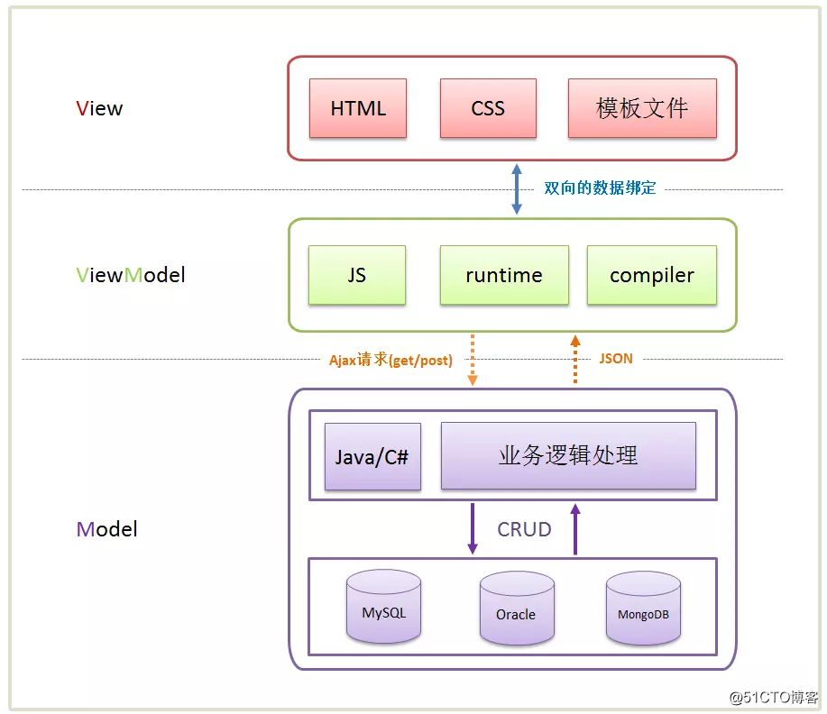
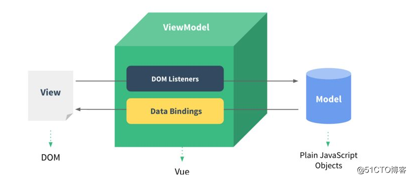

<!--

 * @Description: 
 * @Autor: fengshuai
 * @Date: 2021-07-28 10:27:24
 * @LastEditors: fengshuai
 * @LastEditTime: 2021-08-02 16:44:15
-->

## MVVM原理

### MVC介绍

 **MVC**中的**M**就是单纯的从网络获取回来的数据模型，**V**指的我们的视图界面，而**C**就是我们的ViewController 

在其中，ViewController负责View和Model之间调度，View发生交互事件会通过target-action或者delegate方式回调给ViewController，与此同时ViewController还要承担把Model通过KVO、Notification方式传来的数据传输给View用于展示的责任。**随着业务越来越复杂，视图交互越复杂，导致Controller越来越臃肿，负重前行。脏活累活都它干了，到头来还一点不讨好。福报修多了的结果就是，不行了就重构你，重构不了就换掉你**


### MVVM 介绍

>  MVVM（Model–View–Viewmodel）是一种软件架构模式。 
>
>  它本质上就是MVC 的改进版。MVVM 就是将其中的View 的状态和行为抽象化，让我们将视图 UI 和业务逻辑分开。 

 MVVM的核心是数据驱动即ViewModel，ViewModel是View和Model的关系映射。ViewModel类似中转站(Value Converter)，负责转换Model中的数据对象，使得数据变得更加易于管理和使用。MVVM本质就是基于操作数据来操作视图进而操作DOM，借助于MVVM无需直接操作DOM，开发者只需完成包含声明绑定的视图模板，编写ViewModel中有业务，使得View完全实现自动化。 



Vue中的MVVM思想

ViewModel做了两件事情。
1.**数据绑定** 

把js里面的数据通过插值操作mustachae语法绑定到真实dom里面 而且是响应式的 一旦数据发生改变
自动监听到数据的改变，把最新的数据再重新绑定到view上面，view里面显示得永远是model里面最新的数据

2.**DOM监听**

当view上面有一些事件或者用户操作的时候，通过指令，把事件响应相关的东西，绑定到model里面，在model里面可以写一些js代码（比如回调methods里面定义的一些函数）



* View层
  ​视图层
  在我们开发中，通常就是DOM层
  主要的作用就是给用户展示各种信息

* Model层
  数据层
  数据可能是我们固定的死数据，更多的是来之我们的服务器，从网络上请求下来的数据

* ViewModel层
  视图模型层
  视图模型层是View和Model沟通的桥梁
  一方面它实现了Data Binding,也就是数据绑定，将Model的改变实时的反应到View中
  另一方面实现了DOM Listener, 也就是DOM监听，当DOM发生一些事件（点击，滚动，touch等）时，可以监听到，并在需要的情况下改变Data

### Vue的运行机制简述


#### 初始化流程

- 创建Vue实例对象

- `init`过程会初始化生命周期，初始化事件中心，初始化渲染、执行`beforeCreate`周期函数、初始化 `data`、`props`、`computed`、`watcher`、执行`created`周期函数等。

- 初始化后，调用`$mount`方法对Vue实例进行挂载（挂载的核心过程包括**模板编译**、**渲染**以及**更新**三个过程）。

- 如果没有在Vue实例上定义`render`方法而是定义了`template`，那么需要经历编译阶段。需要先将`template`字符串编译成 `render function`，`template`字符串编译步骤如下 ： 

  - `parse`正则解析`template`字符串形成AST（抽象语法树，是源代码的抽象语法结构的树状表现形式）
  - `optimize`标记静态节点跳过diff算法（diff算法是逐层进行比对，只有同层级的节点进行比对，因此时间的复杂度只有O(n)。如果对于时间复杂度不是很清晰的，可以查看我写的文章[ziyi2/algorithms-javascript/渐进记号](https://link.juejin.cn/?target=https%3A%2F%2Fgithub.com%2Fziyi2%2Falgorithms-javascript%2Fblob%2Fmaster%2Fdoc%2Ffunction-growth%2Fasymptotic-symbol.md)）
  - `generate`将AST转化成`render function`字符串

- 编译成`render function` 后，调用`$mount`的`mountComponent`方法，先执行`beforeMount`钩子函数，然后核心是实例化一个渲染`Watcher`，在它的回调函数（初始化的时候执行，以及组件实例中监测到数据发生变化时执行）中调用`updateComponent`方法（此方法调用`render`方法生成虚拟Node，最终调用`update`方法更新DOM）。

- 调用`render`方法将`render function`渲染成虚拟的Node（真正的 DOM 元素是非常庞大的，因为浏览器的标准就把 DOM 设计的非常复杂。如果频繁的去做 DOM 更新，会产生一定的性能问题，而 Virtual DOM 就是用一个原生的 JavaScript 对象去描述一个 DOM 节点，所以它比创建一个 DOM 的代价要小很多，而且修改属性也很轻松，还可以做到跨平台兼容），`render`方法的第一个参数是`createElement`(或者说是`h`函数)，这个在官方文档也有说明。

- 生成虚拟DOM树后，需要将虚拟DOM树转化成真实的DOM节点，此时需要调用`update`方法，`update`方法又会调用`pacth`方法把虚拟DOM转换成真正的DOM节点。需要注意在图中忽略了新建真实DOM的情况（如果没有旧的虚拟Node，那么可以直接通过`createElm`创建真实DOM节点），这里重点分析在已有虚拟Node的情况下，会通过`sameVnode`判断当前需要更新的Node节点是否和旧的Node节点相同（例如我们设置的`key`属性发生了变化，那么节点显然不同），如果节点不同那么将旧节点采用新节点替换即可，如果相同且存在子节点，需要调用`patchVNode`方法执行diff算法更新DOM，从而提升DOM操作的性能

> 需要注意在初始化阶段，没有详细描述数据的响应式过程，这个在响应式流程里做说明。 

#### 响应式流程

- 在`init`的时候会利用`Object.defineProperty`方法（不兼容IE8）监听Vue实例的响应式数据的变化从而实现数据劫持能力（利用了JavaScript对象的访问器属性`get`和`set`，在未来的Vue3中会使用ES6的`Proxy`来优化响应式原理）。在初始化流程中的编译阶段，当`render function`被渲染的时候，会读取Vue实例中和视图相关的响应式数据，此时会触发`getter`函数进行**依赖收集**（将观察者`Watcher`对象存放到当前闭包的订阅者`Dep`的`subs`中），此时的数据劫持功能和观察者模式就实现了一个MVVM模式中的**Binder**，之后就是正常的渲染和更新流程。
- 当数据发生变化或者视图导致的数据发生了变化时，会触发数据劫持的`setter`函数，`setter`会通知初始化**依赖收集**中的`Dep`中的和视图相应的`Watcher`，告知需要重新渲染视图，`Wather`就会再次通过`update`方法来更新视图。

> 可以发现只要视图中添加监听事件，自动变更对应的数据变化时，就可以实现数据和视图的双向绑定了。

### 几种实现双向绑定的做法

目前几种主流的mvc(vm)框架都实现了单向数据绑定，而我所理解的双向数据绑定无非就是在单向绑定的基础上给可输入元素（input、textarea等）添加了change(input)事件，来动态修改model和 view，并没有多高深。所以无需太过介怀是实现的单向或双向绑定。

实现数据绑定的做法有大致如下几种：

> 发布者-订阅者模式（backbone.js）

> 脏值检查（angular.js）

> 数据劫持（vue.js)

 **发布者-订阅者模式:** 一般通过sub, pub的方式实现数据和视图的绑定监听，更新数据方式通常做法是 `vm.set('property', value)`，这里有篇文章讲的比较详细，有兴趣可点[这里](http://www.html-js.com/article/Study-of-twoway-data-binding-JavaScript-talk-about-JavaScript-every-day) 

这种方式现在毕竟太low了，我们更希望通过 `vm.property = value `这种方式更新数据，同时自动更新视图，于是有了下面两种方式

**脏值检查:** angular.js 是通过脏值检测的方式比对数据是否有变更，来决定是否更新视图，最简单的方式就是通过 `setInterval()` 定时轮询检测数据变动，当然Google不会这么low，angular只有在指定的事件触发时进入脏值检测，大致如下：

- DOM事件，譬如用户输入文本，点击按钮等。( ng-click )
- XHR响应事件 ( $http )
- 浏览器Location变更事件 ( $location )
- Timer事件( $timeout , $interval )
- 执行 $digest() 或 $apply()

**数据劫持:** vue.js 则是采用数据劫持结合发布者-订阅者模式的方式，通过`Object.defineProperty()`来劫持各个属性的`setter`，`getter`，在数据变动时发布消息给订阅者，触发相应的监听回调。

**思路整理**

已经了解到vue是通过数据劫持的方式来做数据绑定的，其中最核心的方法便是通过`Object.defineProperty()`来实现对属性的劫持，达到监听数据变动的目的，无疑这个方法是本文中最重要、最基础的内容之一，如果不熟悉defineProperty，猛戳[这里](https://developer.mozilla.org/zh-CN/docs/Web/JavaScript/Reference/Global_Objects/Object/defineProperty) 整理了一下，要实现mvvm的双向绑定，就必须要实现以下几点： 1、实现一个数据监听器Observer，能够对数据对象的所有属性进行监听，如有变动可拿到最新值并通知订阅者 2、实现一个指令解析器Compile，对每个元素节点的指令进行扫描和解析，根据指令模板替换数据，以及绑定相应的更新函数 3、实现一个Watcher，作为连接Observer和Compile的桥梁，能够订阅并收到每个属性变动的通知，执行指令绑定的相应回调函数，从而更新视图 4、mvvm入口函数，整合以上三者

### 1、实现Observer

let's do it 我们知道可以利用`Obeject.defineProperty()`来监听属性变动 那么将需要observe的数据对象进行递归遍历，包括子属性对象的属性，都加上 `setter`和`getter` 这样的话，给这个对象的某个值赋值，就会触发`setter`，那么就能监听到了数据变化。。相关代码可以是这样： 

```js
var data = {name: 'kindeng'};
observe(data);
data.name = 'dmq'; // 哈哈哈，监听到值变化了 kindeng --> dmq

function observe(data) {
    if (!data || typeof data !== 'object') {
        return;
    }
    // 取出所有属性遍历
    Object.keys(data).forEach(function(key) {
	    defineReactive(data, key, data[key]);
	});
};

function defineReactive(data, key, val) {
    observe(val); // 监听子属性
    Object.defineProperty(data, key, {
        enumerable: true, // 可枚举
        configurable: false, // 不能再define
        get: function() {
            return val;
        },
        set: function(newVal) {
            console.log('哈哈哈，监听到值变化了 ', val, ' --> ', newVal);
            val = newVal;
        }
    });
}

```

这样我们已经可以监听每个数据的变化了，那么监听到变化之后就是怎么通知订阅者了，所以接下来我们需要实现一个消息订阅器，很简单，维护一个数组，用来收集订阅者，数据变动触发notify，再调用订阅者的update方法，代码改善之后是这样： 

```js
// ... 省略
function defineReactive(data, key, val) {
	var dep = new Dep();
    observe(val); // 监听子属性

    Object.defineProperty(data, key, {
        // ... 省略
        set: function(newVal) {
        	if (val === newVal) return;
            console.log('哈哈哈，监听到值变化了 ', val, ' --> ', newVal);
            val = newVal;
            dep.notify(); // 通知所有订阅者
        }
    });
}

function Dep() {
    this.subs = [];
}
Dep.prototype = {
    addSub: function(sub) {
        this.subs.push(sub);
    },
    notify: function() {
        this.subs.forEach(function(sub) {
            sub.update();
        });
    }
};
```

那么问题来了，谁是订阅者？怎么往订阅器添加订阅者？ 没错，上面的思路整理中我们已经明确订阅者应该是Watcher, 而且`var dep = new Dep();`是在 `defineReactive`方法内部定义的，所以想通过`dep`添加订阅者，就必须要在闭包内操作，所以我们可以在 `getter`里面动手脚： 

```js
// Observer.js
// ...省略
Object.defineProperty(data, key, {
	get: function() {
		// 由于需要在闭包内添加watcher，所以通过Dep定义一个全局target属性，暂存watcher, 添加完移除
		Dep.target && dep.addDep(Dep.target);
		return val;
	}
    // ... 省略
});

// Watcher.js
Watcher.prototype = {
	get: function(key) {
		Dep.target = this;
		this.value = data[key];	// 这里会触发属性的getter，从而添加订阅者
		Dep.target = null;
	}
}
```

这里已经实现了一个Observer了，已经具备了监听数据和数据变化通知订阅者的功能，[完整代码](https://github.com/DMQ/mvvm/blob/master/js/observer.js)。那么接下来就是实现Compile了 

### 2、实现Compile

compile主要做的事情是解析模板指令，将模板中的变量替换成数据，然后初始化渲染页面视图，并将每个指令对应的节点绑定更新函数，添加监听数据的订阅者，一旦数据有变动，收到通知，更新视图

 因为遍历解析的过程有多次操作dom节点，为提高性能和效率，会先将vue实例根节点的`el`转换成文档碎片`fragment`进行解析编译操作，解析完成，再将`fragment`添加回原来的真实dom节点中 

```js
function Compile(el) {
    this.$el = this.isElementNode(el) ? el : document.querySelector(el);
    if (this.$el) {
        this.$fragment = this.node2Fragment(this.$el);
        this.init();
        this.$el.appendChild(this.$fragment);
    }
}
Compile.prototype = {
	init: function() { this.compileElement(this.$fragment); },
    node2Fragment: function(el) {
        var fragment = document.createDocumentFragment(), child;
        // 将原生节点拷贝到fragment
        while (child = el.firstChild) {
            fragment.appendChild(child);
        }
        return fragment;
    }
};
```

compileElement方法将遍历所有节点及其子节点，进行扫描解析编译，调用对应的指令渲染函数进行数据渲染，并调用对应的指令更新函数进行绑定，详看代码及注释说明 

```js
Compile.prototype = {
	// ... 省略
	compileElement: function(el) {
        var childNodes = el.childNodes, me = this;
        [].slice.call(childNodes).forEach(function(node) {
            var text = node.textContent;
            var reg = /\{\{(.*)\}\}/;	// 表达式文本
            // 按元素节点方式编译
            if (me.isElementNode(node)) {
                me.compile(node);
            } else if (me.isTextNode(node) && reg.test(text)) {
                me.compileText(node, RegExp.$1);
            }
            // 遍历编译子节点
            if (node.childNodes && node.childNodes.length) {
                me.compileElement(node);
            }
        });
    },

    compile: function(node) {
        var nodeAttrs = node.attributes, me = this;
        [].slice.call(nodeAttrs).forEach(function(attr) {
            // 规定：指令以 v-xxx 命名
            // 如 <span v-text="content"></span> 中指令为 v-text
            var attrName = attr.name;	// v-text
            if (me.isDirective(attrName)) {
                var exp = attr.value; // content
                var dir = attrName.substring(2);	// text
                if (me.isEventDirective(dir)) {
                	// 事件指令, 如 v-on:click
                    compileUtil.eventHandler(node, me.$vm, exp, dir);
                } else {
                	// 普通指令
                    compileUtil[dir] && compileUtil[dir](node, me.$vm, exp);
                }
            }
        });
    }
};

// 指令处理集合
var compileUtil = {
    text: function(node, vm, exp) {
        this.bind(node, vm, exp, 'text');
    },
    // ...省略
    bind: function(node, vm, exp, dir) {
        var updaterFn = updater[dir + 'Updater'];
        // 第一次初始化视图
        updaterFn && updaterFn(node, vm[exp]);
        // 实例化订阅者，此操作会在对应的属性消息订阅器中添加了该订阅者watcher
        new Watcher(vm, exp, function(value, oldValue) {
        	// 一旦属性值有变化，会收到通知执行此更新函数，更新视图
            updaterFn && updaterFn(node, value, oldValue);
        });
    }
};

// 更新函数
var updater = {
    textUpdater: function(node, value) {
        node.textContent = typeof value == 'undefined' ? '' : value;
    }
    // ...省略
};
```
这里通过递归遍历保证了每个节点及子节点都会解析编译到，包括了{{}}表达式声明的文本节点。指令的声明规定是通过特定前缀的节点属性来标记，如`中`v-text`便是指令，而`other-attr`不是指令，只是普通的属性。 监听数据、绑定更新函数的处理是在`compileUtil.bind()`这个方法中，通过`new Watcher()`添加回调来接收数据变化的通知

至此，一个简单的Compile就完成了，[完整代码](https://github.com/DMQ/mvvm/blob/master/js/compile.js)。接下来要看看Watcher这个订阅者的具体实现了

### 3、实现Watcher

Watcher订阅者作为Observer和Compile之间通信的桥梁，主要做的事情是: 1、在自身实例化时往属性订阅器(dep)里面添加自己 2、自身必须有一个update()方法 3、待属性变动dep.notice()通知时，能调用自身的update()方法，并触发Compile中绑定的回调，则功成身退。 如果有点乱，可以回顾下前面的[思路整理](https://github.com/DMQ/mvvm#_2)

```js
function Watcher(vm, exp, cb) {
    this.cb = cb;
    this.vm = vm;
    this.exp = exp;
    // 此处为了触发属性的getter，从而在dep添加自己，结合Observer更易理解
    this.value = this.get(); 
}
Watcher.prototype = {
    update: function() {
        this.run();	// 属性值变化收到通知
    },
    run: function() {
        var value = this.get(); // 取到最新值
        var oldVal = this.value;
        if (value !== oldVal) {
            this.value = value;
            this.cb.call(this.vm, value, oldVal); // 执行Compile中绑定的回调，更新视图
        }
    },
    get: function() {
        Dep.target = this;	// 将当前订阅者指向自己
        var value = this.vm[exp];	// 触发getter，添加自己到属性订阅器中
        Dep.target = null;	// 添加完毕，重置
        return value;
    }
};
// 这里再次列出Observer和Dep，方便理解
Object.defineProperty(data, key, {
	get: function() {
		// 由于需要在闭包内添加watcher，所以可以在Dep定义一个全局target属性，暂存watcher, 添加完移除
		Dep.target && dep.addDep(Dep.target);
		return val;
	}
    // ... 省略
});
Dep.prototype = {
    notify: function() {
        this.subs.forEach(function(sub) {
            sub.update(); // 调用订阅者的update方法，通知变化
        });
    }
};
```

实例化`Watcher`的时候，调用`get()`方法，通过`Dep.target = watcherInstance`标记订阅者是当前watcher实例，强行触发属性定义的`getter`方法，`getter`方法执行的时候，就会在属性的订阅器`dep`添加当前watcher实例，从而在属性值有变化的时候，watcherInstance就能收到更新通知。

ok, Watcher也已经实现了，[完整代码](https://github.com/DMQ/mvvm/blob/master/js/watcher.js)。 基本上vue中数据绑定相关比较核心的几个模块也是这几个，猛戳[这里](https://github.com/vuejs/vue) , 在`src` 目录可找到vue源码。

### 4、实现MVVM

MVVM作为数据绑定的入口，整合Observer、Compile和Watcher三者，通过Observer来监听自己的model数据变化，通过Compile来解析编译模板指令，最终利用Watcher搭起Observer和Compile之间的通信桥梁，达到数据变化 -> 视图更新；视图交互变化(input) -> 数据model变更的双向绑定效果。

一个简单的MVVM构造器是这样子：

```js
function MVVM(options) {
    this.$options = options;
    var data = this._data = this.$options.data;
    observe(data, this);
    this.$compile = new Compile(options.el || document.body, this)
}
```

但是这里有个问题，从代码中可看出监听的数据对象是options.data，每次需要更新视图，则必须通过`var vm = new MVVM({data:{name: 'kindeng'}}); vm._data.name = 'dmq'; `这样的方式来改变数据。

显然不符合我们一开始的期望，我们所期望的调用方式应该是这样的： `var vm = new MVVM({data: {name: 'kindeng'}}); vm.name = 'dmq';`

所以这里需要给MVVM实例添加一个属性代理的方法，使访问vm的属性代理为访问vm._data的属性，改造后的代码如下：

```js
function MVVM(options) {
    this.$options = options;
    var data = this._data = this.$options.data, me = this;
    // 属性代理，实现 vm.xxx -> vm._data.xxx
    Object.keys(data).forEach(function(key) {
        me._proxy(key);
    });
    observe(data, this);
    this.$compile = new Compile(options.el || document.body, this)
}

MVVM.prototype = {
	_proxy: function(key) {
		var me = this;
        Object.defineProperty(me, key, {
            configurable: false,
            enumerable: true,
            get: function proxyGetter() {
                return me._data[key];
            },
            set: function proxySetter(newVal) {
                me._data[key] = newVal;
            }
        });
	}
};
```

这里主要还是利用了`Object.defineProperty()`这个方法来劫持了vm实例对象的属性的读写权，使读写vm实例的属性转成读写了`vm._data`的属性值，达到鱼目混珠的效果 

