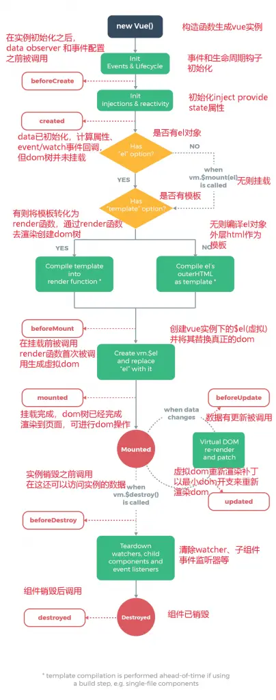

<!--
 * @Description: 
 * @Autor: fengshuai
 * @Date: 2023-06-02 11:09:35
 * @LastEditors: fengshuai
 * @LastEditTime: 2023-06-02 17:43:25
-->
# [vue生命周期](https://ustbhuangyi.github.io/vue-analysis/v2/components/lifecycle.html#beforecreate-created)

Vue生命周期一共有11个钩子函数，在Vue实例被创建之后，Vue挂载元素阶段会有4个钩子函数，它们是自动执行的且只执行一次，数据更新阶段有2个钩子函数会被执行，销毁阶段有2个钩子会被执行

### 实例构建挂载阶段:

#### 1.beforeCreate

实例刚刚被创建，此时实例上还没有数据，也没有计算属性，但是可以方位$el和$options，此时还不能访问data和methods

（在实例初始化之后，数据观测 (dataobserver) 和 event/watcher 事件配置之前被调用。访问不到数据）

#### 2.created 

实例已经创建完成，此时可以访问data和methods，但是还没有开始挂载，$el属性还不存在

（在实例创建完成后被立即调用 可以获取数据 (常用作发送异步请求获取数据)）

#### 3.beforeMount

此时实例已经挂在到DOM上，但是DOM还没有更新，$el属性已存在，但是它还不可见

（在挂载开始之前被调用可以访问数据编译模板结束，虚拟dom已经存在）

#### 4.mounted

此时实例已经挂在到DOM上，DOM已经更新，$el属性可见，可以通过this.$el访问

（可以拿到节点和数据  常用实例被挂载后调用.

注意: mounted **不会**保证所有的子组件也都一起被挂载。如果你希望等到整个视图都渲染完毕，可以在 mounted 内部使用 Vue实例[.$nextTick](https://links.jianshu.com/go?to=https%3A%2F%2Fcn.vuejs.org%2Fv2%2Fapi%2F%23vm-nextTick)：在Vue实例上有一个方法，它会延迟执行，直到Dom加载完成.

补充:ref表示节点this.$refs.ref的标识 就可以拿到节点了）

### 数据更新阶段:

#### 1.beforeUpdate

状态更新之前调用，此时data已更新，但是DOM还没更新

（数据更新时调用，发生在虚拟DOM打补丁之前。这里适合在更新之前访问现有的 DOM，比如手动移除已添加的事件监听器。）

#### 2.updated

状态更新之后调用，此时data已更新，DOM也更新了

（常用的监控数据的变化由于数据更改导致的虚拟DOM重新渲染和打补丁

补充:watch是监控特定数据的变化，updated是监控组件里所有数据的变化）

### 销毁阶段:

#### 1.beforeDestroy

实例销毁之前调用，此时实例上的事件监听和watch都已经被移除，但是DOM还没被移除

（实例销毁之前调用，在这一步，实例仍然完全可用。  常用于清理资源，防止内存的泄露）

#### 2.destroyed 

实例销毁之后调用，此时实例上的事件监听和watch都已经被移除，DOM也被移除了

（实例销毁后调用。该钩子被调用后,对应 Vue 实例的所有指令都被解绑，所有的事件监听器被移除，所有的子实例也都被销毁。）

#### 还有2个钩子函数是与组件一起使用的

#### 1.activated

 被keep-alive 缓存的组件激活时调用。

####  2.deactivated 

被keep-alive 缓存的组件停用时调用。

#### 此外还有一个2.5.0新增的钩子函数，主要用来错误捕获

#### 1.errorCaptured

当捕获一个来自子孙组件的错误时被调用。

此钩子会收到三个参数：错误对象、发生错误的组件实例以及一个包含错误来源信息的字符串。此钩子可以返回 false 以阻止该错误继续向上传播。