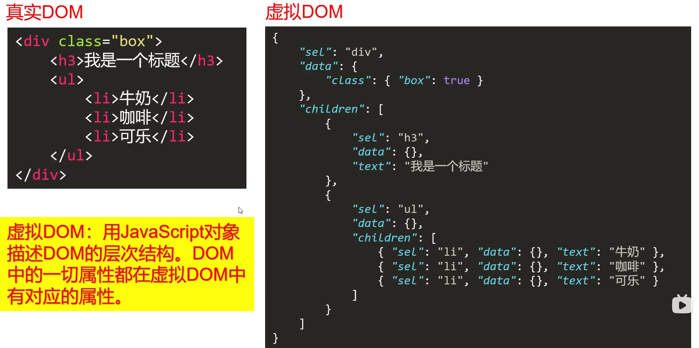
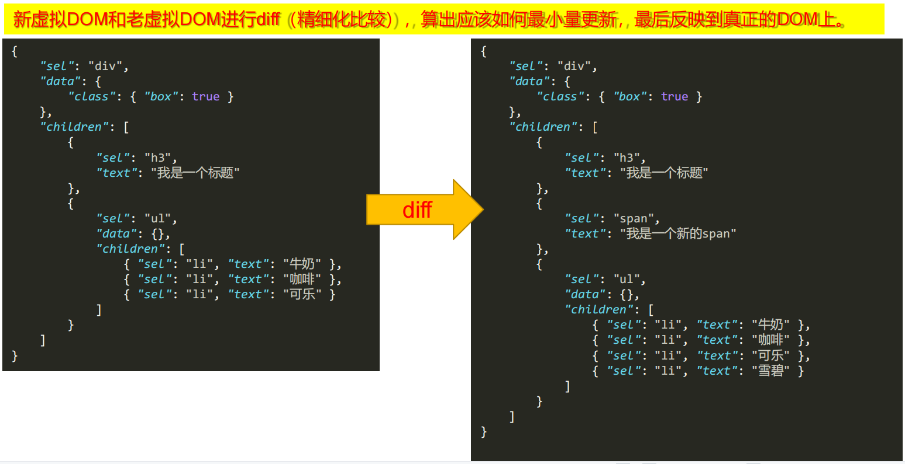
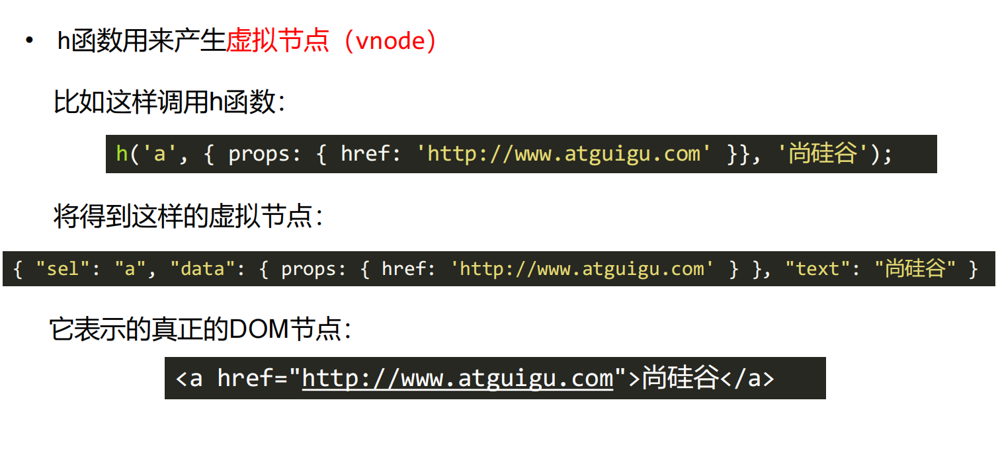
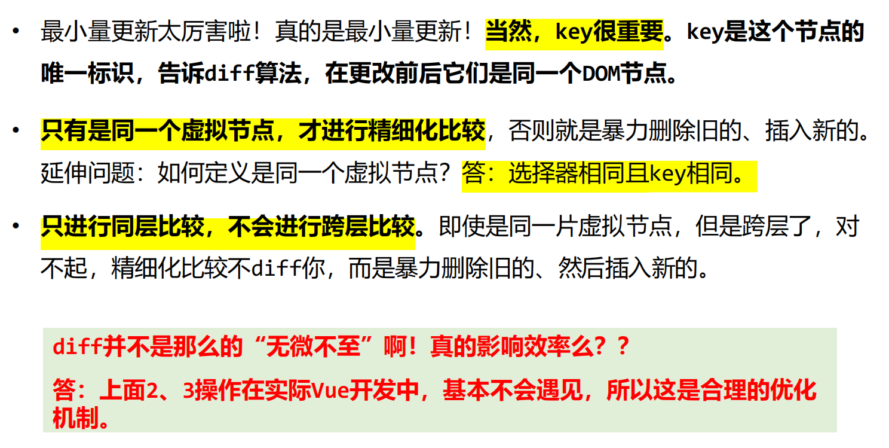

<!--
 * @Description: vue源码学习笔记
 * @Autor: fengshuai
 * @Date: 2022-06-27 15:27:00
 * @LastEditors: fengshuai
 * @LastEditTime: 2022-06-28 09:58:24
-->
# Vue源码之mustache模板引擎

## 历史上数据变为视图的方法

1. 纯DOM法：非常笨拙，没有实用价值
2. 数组join法：曾几何时非常流行，是曾经前端的必会知识
3. ES6的反引导法：ES6中新增的`${a}`语法糖，很好用
4. 模板引擎：**解决数据变为视图的最优雅的方法**

## mustache模板引擎的使用

### mustache使用

1. 必须引入mustache库
2. 使用{{ }}
3. Mustache.render(template, data)

例1: 一层对象

```javascript
var template1 = `我买了一个{{thing}}，好{{mood}}啊`;
var data1 = {
      thing: '苹果手机',
      mood: '开心'
    }

var domStr = Mustache.render(myTemplate1, data1)
var container = document.getElementById('container')
container.innerHTML = domStr
```

例2：一层数组

```js
var template2 = `<ul>
      {{#arr}}
      <li>{{.}}</li>
      {{/arr}}
    </ul>`;
var data2 = {
	arr: ['苹果', '菠萝', '哈密瓜']
};

var domStr = Mustache.render(myTemplate2, data2)
var container = document.getElementById('container')
container.innerHTML = domStr
```

例3：数组对象

```js
var template = `
  <ul>
    {{#arr}}
      <li>
        <div class="hd">{{name}}的基本信息</div>
        <div class="bd">
          <p>姓名：{{name}}</p>
          <p>性别：{{sex}}</p>
          <p>年龄：{{age}}</p>
        </div>
      </li>
    {{/arr}}
  </ul>
  `;
var data = {
  arr: [
    {name: '小明', sex: '男', age: 13},
    {name: '小刚', sex: '男', age: 23},
    {name: '小丽', sex: '女', age: 17},
  ]
}
    
var domStr = Mustache.render(myTemplate, data)
var container = document.getElementById('container')
container.innerHTML = domStr
```

例4：布尔

```js
var template3 = `
  <div>
    {{#m}}
    <h1>你好</h1>
    {{/m}}
  </div>`;
var data3 = {
  m: true
}
    
var domStr = Mustache.render(myTemplate, data)
var container = document.getElementById('container')
container.innerHTML = domStr
```

正则匹配({{}})：

```js
console.log(template1.replace(/\{\{\w+\}\}/g, function(a,b,c){
  console.log(a, 'a', b, 'b', c, 'c');
  return '++'
}));
```


### mustache机理


模板字符串(翻译)=>(tokens+数据)(解析)=>dom字符串

> 1. 将模板字符串编译为tokens形式
> 2. 将tokens结合数据，编译为dom字符串

**模板字符串：**


`<h1>我买了一个{{thing}}，好{{mood}}啊</h1>`

**数据：**

```json
{
    thing: '苹果手机'，
    mood：'开心'
}
```

**tokens：**


```json
[
    ["text", "<h1>我买了一个"]，
    ["name", "thing"],
	["text", ",好"],
	["name", "mood"],
	["text", "啊</h1>"],
]
```

*当模板字符串中有循环存在时，它将被编译为**嵌套更深**的tokens

```html
<div>
    <ul>
        {{#arr}}
        <li>{{.}}</li>
        {{/arr}}
    </ul>
</div>
```

```json
[
    ["text", "<div><ul>"],
    ["#", "arr", [
        ["text", "<li>"],
        ["name:", "."],
        ["text", "</li>"]
    ]],
    ["text", "</ul></div>"]
]
```

*当循环是双重的，那么tokens会更深一些

```html
<div>
    <ul>
        {{#students}}
        <li>
            学生{{item.name}}的爱好是
            <ol>
                {{#hobbies}}
                <li>{{.}}</li>
                {{/hobbies}}
            </ol>
        </li>
        {{/students}}
    </ul>
</div>
```

```json
[
    ["text", "<div><ul>"],
    ["#", "students", null, null, [ // null是真实token，这里是位置标签	
        ["text", "<li>学生"],
        ["name", "name"],
     	["text”, "的爱好是<ol>"],
        ["#", "hobbies", null, null, [
         	["text", "<li>"],
     		["name", "."],
     		["text", "</li"],
        ]],
		["text", "</ol></li>"],
    ]],
	["text", "</ul></div>"]
]
```

### 手写实现mustache

见 myTemplateEngine 文件夹

# Vue源码之虚拟DOM和diff算法

## 虚拟DOM



## diff发生在虚拟DOM上



## h函数产生虚拟节点



## 一个虚拟节点有哪些属性

```js
{
    children: undefined // 子元素
    elm: undefined // 是否上树
    data: {}
    key: undefined // 节点得唯一标识
    sel: 'div' // 对应得元素标签
    text: '我是一个div盒子'
    
}
```

## diff算法




# Vue源码之数据响应式原理

# Vue源码之AST抽象语法树

# Vue源码之指令和生命周期


