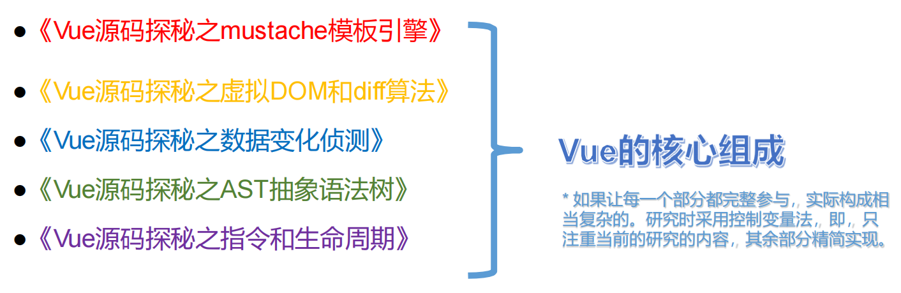

<!--

 * @Description: vue源码学习笔记
 * @Autor: fengshuai
 * @Date: 2022-06-27 15:27:00
 * @LastEditors: fengshuai
 * @LastEditTime: 2022-06-28 09:58:24
-->
# Vue源码之mustache模板引擎

## 历史上数据变为视图的方法

1. 纯DOM法：非常笨拙，没有实用价值
2. 数组join法：曾几何时非常流行，是曾经前端的必会知识
3. ES6的反引导法：ES6中新增的`${a}`语法糖，很好用
4. 模板引擎：**解决数据变为视图的最优雅的方法**

## mustache模板引擎的使用

### mustache使用

1. 必须引入mustache库
2. 使用{{ }}
3. Mustache.render(template, data)

例1: 一层对象

```javascript
var template1 = `我买了一个{{thing}}，好{{mood}}啊`;
var data1 = {
      thing: '苹果手机',
      mood: '开心'
    }

var domStr = Mustache.render(myTemplate1, data1)
var container = document.getElementById('container')
container.innerHTML = domStr
```

例2：一层数组

```js
var template2 = `<ul>
      {{#arr}}
      <li>{{.}}</li>
      {{/arr}}
    </ul>`;
var data2 = {
	arr: ['苹果', '菠萝', '哈密瓜']
};

var domStr = Mustache.render(myTemplate2, data2)
var container = document.getElementById('container')
container.innerHTML = domStr
```

例3：数组对象

```js
var template = `
  <ul>
    {{#arr}}
      <li>
        <div class="hd">{{name}}的基本信息</div>
        <div class="bd">
          <p>姓名：{{name}}</p>
          <p>性别：{{sex}}</p>
          <p>年龄：{{age}}</p>
        </div>
      </li>
    {{/arr}}
  </ul>
  `;
var data = {
  arr: [
    {name: '小明', sex: '男', age: 13},
    {name: '小刚', sex: '男', age: 23},
    {name: '小丽', sex: '女', age: 17},
  ]
}
    
var domStr = Mustache.render(myTemplate, data)
var container = document.getElementById('container')
container.innerHTML = domStr
```

例4：布尔

```js
var template3 = `
  <div>
    {{#m}}
    <h1>你好</h1>
    {{/m}}
  </div>`;
var data3 = {
  m: true
}
    
var domStr = Mustache.render(myTemplate, data)
var container = document.getElementById('container')
container.innerHTML = domStr
```

正则匹配({{}})：

```js
console.log(template1.replace(/\{\{\w+\}\}/g, function(a,b,c){
  console.log(a, 'a', b, 'b', c, 'c');
  return '++'
}));
```


### mustache机理


模板字符串(翻译)=>(tokens+数据)(解析)=>dom字符串

> 1. 将模板字符串编译为tokens形式
> 2. 将tokens结合数据，编译为dom字符串

**模板字符串：**


`<h1>我买了一个{{thing}}，好{{mood}}啊</h1>`

**数据：**

```json
{
    thing: '苹果手机'，
    mood：'开心'
}
```

**tokens：**


```json
[
    ["text", "<h1>我买了一个"]，
    ["name", "thing"],
	["text", ",好"],
	["name", "mood"],
	["text", "啊</h1>"],
]
```

*当模板字符串中有循环存在时，它将被编译为**嵌套更深**的tokens

```html
<div>
    <ul>
        {{#arr}}
        <li>{{.}}</li>
        {{/arr}}
    </ul>
</div>
```

```json
[
    ["text", "<div><ul>"],
    ["#", "arr", [
        ["text", "<li>"],
        ["name:", "."],
        ["text", "</li>"]
    ]],
    ["text", "</ul></div>"]
]
```

*当循环是双重的，那么tokens会更深一些

```html
<div>
    <ul>
        {{#students}}
        <li>
            学生{{item.name}}的爱好是
            <ol>
                {{#hobbies}}
                <li>{{.}}</li>
                {{/hobbies}}
            </ol>
        </li>
        {{/students}}
    </ul>
</div>
```

```json
[
    ["text", "<div><ul>"],
    ["#", "students", null, null, [ // null是真实token，这里是位置标签	
        ["text", "<li>学生"],
        ["name", "name"],
     	["text”, "的爱好是<ol>"],
        ["#", "hobbies", null, null, [
         	["text", "<li>"],
     		["name", "."],
     		["text", "</li"],
        ]],
		["text", "</ol></li>"],
    ]],
	["text", "</ul></div>"]
]
```

### 手写实现mustache

见 myTemplateEngine 文件夹

# Vue源码之虚拟DOM和diff算法

## 虚拟DOM


## diff发生在虚拟DOM上


## h函数产生虚拟节点


## 一个虚拟节点有哪些属性

```js
{
    children: undefined // 子元素
    elm: undefined // 是否上树
    data: {}
    key: undefined // 节点得唯一标识
    sel: 'div' // 对应得元素标签
    text: '我是一个div盒子'
    
}
```

## diff算法


## diff算法优化策略


1. 新增的情况


2. 删除的情况


3. 多删除的情况


4. 复杂的情况


# Vue源码之数据响应式原理

## 原理


## MVVM案例


## 侵入式和非侵入式


## Object.defineProperty()

Object.defineProperty()方法会直接在一个对象上定义一个新属性，或者修改 

一个对象的现有属性，并返回此对象。

```js
var obj = {}
Object.defineProperty(obj, 'a', {
    value: 3
})
Object.defineProperty(obj, 'b', {
    value: 5
})
console.log(obj, obj.a, obj.b)
```

Object.defineProperty()方法可以设置一些额外隐藏的属性

```js
Object.defineProprety(obj, 'a', {
    value: 3,
    writable: false // 是否可写
    enumerable: false // 是否可以被枚举
})
```

## getter/setter

get

属性的 getter 函数，如果没有 getter，则为 `undefined`。当访问该属性时，会调用此函数。执行时不传入任何参数，但是会传入 `this` 对象（由于继承关系，这里的`this`并不一定是定义该属性的对象）。该函数的返回值会被用作属性的值。 **默认为 [`undefined`](https://developer.mozilla.org/zh-CN/docs/Web/JavaScript/Reference/Global_Objects/undefined)**。

set

属性的 setter 函数，如果没有 setter，则为 `undefined`。当属性值被修改时，会调用此函数。该方法接受一个参数（也就是被赋予的新值），会传入赋值时的 `this` 对象。 **默认为 [`undefined`](https://developer.mozilla.org/zh-CN/docs/Web/JavaScript/Reference/Global_Objects/undefined)**。

**小坑**： 用闭包存储get和set的值

```js
Object.defineProperty(obj, 'a', {
    // getter
    get() {
        console.log('你试图访问obj的a属性')
    }，
    //setter
    set() {
    console.log('你试图改变obj的a属性')
	}
})
console.log(obj.a)
obj.a = 10
```

## defineReactive函数

getter/setter需要变量周转才能工作

```js
var temp;
Object.defineProperty(obj, 'a', {
  // getter 
  get() {
    console.log('你试图访问obj的a属性'); 
    return temp;
  },
  // setter 
  set(newValue) {
    console.log('你试图改变obj的a属性', newValue); 
    temp = newValue; }
});
```

使用defineReactive函数不需要设置临时变量，而是用闭包

```js
function defineReactive(data, key, val) {
    Object.defineProperty(data, key, {
        // 可枚举
        enumerable: true,
        // 可以被配置，比如可以被delete
        configurable: true,
        // getter
        get() {
            console.log('你试图访问obj的' + key + '属性')
            return val
        },
        // setter
        set(newValue) {
            console.log('你试图改变obj的' + key + '属性', newValue)
            if (val === newValue) {
                return
            }
            val = newValue
        }
    })
}
```

## 递归侦测对象全部属性


## 数组响应式


## 依赖收集

什么是依赖

* 需要用到数据的地方，称为依赖
* Vue1.x   **细粒度**依赖，用到数据的**DOM**都是依赖
* Vue2.x   **中等粒度**依赖，用到数据的**组件**都是依赖
* 在getter中收集依赖，在setter中触发依赖

dep类和watch类

* 把依赖收集的代码封装成一个Dep类，它专门用来管理依赖，**每个Observer的实例，成员中都有一个Dep的实例**

* Watcher是一个中介，数据发生变化时通过Watcher中转，通知组件

  

* 依赖就是Watcher。只有Watcher触发的getter才会收集依赖，哪个 Watcher触发了getter，就把哪个Watcher收集到Dep中。

* Dep使用发布订阅模式，当数据发生变化时，会循环依赖列表，把所 有的Watcher都通知一遍

* 代码实现的巧妙之处：Watcher把自己设置到全局的一个指定位置， 然后读取数据，因为读取了数据，所以会触发这个数据的getter。在 getter中就能得到当前正在读取数据的Watcher，并把这个Watcher   收集到Dep中。

  

# Vue源码之AST抽象语法树

## AST是什么


## AST本质


## AST与虚拟节点关系


## 算法储备

1. 指针思想
2. 递归深入（一般用于规则复现）
3. 栈思想

# Vue源码之指令和生命周期

## Vue核心组成



